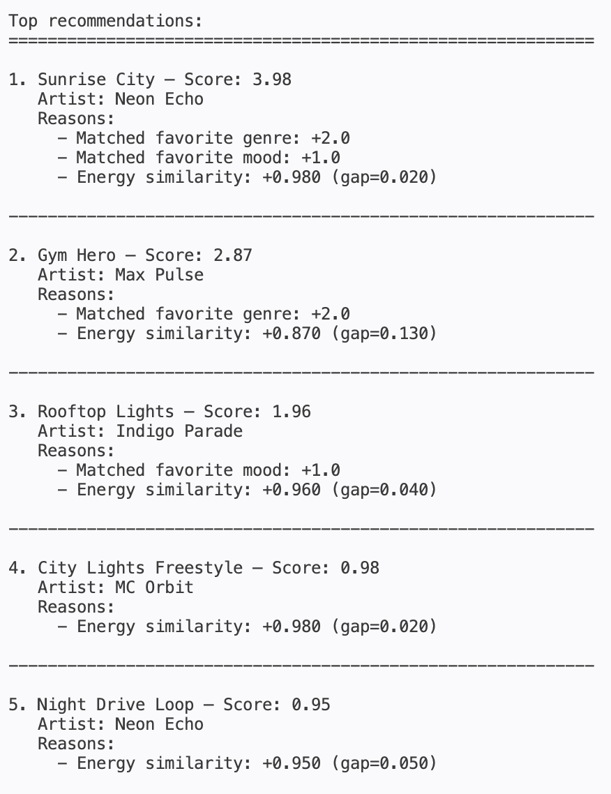

# 🎵 Music Recommender Simulation

## Project Summary

In this project you will build and explain a small music recommender system.

Your goal is to:

- Represent songs and a user "taste profile" as data
- Design a scoring rule that turns that data into recommendations
- Evaluate what your system gets right and wrong
- Reflect on how this mirrors real world AI recommenders

Replace this paragraph with your own summary of what your version does.

---

## How The System Works

This project uses a content-based recommender: it compares a compact `UserProfile` to each song in `data/songs.csv` using a math-based Scoring Rule, then ranks candidates to produce Top-K recommendations.

```mermaid
flowchart TD
   U[User Preferences] --> L[Load data/songs.csv]
   L --> Loop{For each song}
   Loop --> Read[Read song attributes]
   Read --> Cat[Categorical match: genre & mood]
   Read --> Num[Numeric similarities: energy, valence, danceability, acousticness, tempo]
   Cat --> NormCat[Normalize categorical (0..1)]
   Num --> NormNum[Normalize numeric similarities (0..1)]
   NormCat --> Score[Weighted sum -> Song score]
   NormNum --> Score
   Score --> Collect[Collect scores]
   Collect --> Sort[Sort songs by score (desc)]
   Sort --> Rerank[Optional diversity / artist cap]
   Rerank --> Output[Top K recommendations]
```

Song features used in this simulation:

- `id`, `title`, `artist` (identifiers/metadata)
- `genre` (categorical)
- `mood` (categorical)
- `energy` (numeric, 0–1)
- `tempo_bpm` (numeric)
- `valence` (numeric, 0–1)
- `danceability` (numeric, 0–1)
- `acousticness` (numeric, 0–1)

`UserProfile` fields used in this simulation:

- `liked_song_ids` (list of song ids the user likes)
- `genre_preferences` (counts or normalized weights)
- `avg_energy`, `avg_tempo_norm`, `avg_valence` (per-feature averages)
- `preference_vector` (averaged song feature vector used for scoring)
- `feature_weights` (optional weights to prioritize some features)

**Algorithm Recipe**

1. Input: load `UserProfile` (target genre, mood, `target_energy`, weights) and songs from `data/songs.csv`.
2. For each song:
    - Compute categorical score: `cat = 2*genre_match + 1*mood_match` then `Cat_norm = cat / 3`.
    - Compute energy similarity using a Gaussian kernel:
       $$S_e = \exp\left(-\dfrac{(e_{song}-e_{user})^2}{2\sigma^2}\right)$$
       with a default `sigma = 0.15`.
    - Compute additional numeric similarities (valence, danceability, acousticness) using the same Gaussian kernel or `1 - |x-y|` after normalizing tempo to [0,1].
    - Normalize all component scores to [0,1].
    - Combine with weights (sum to 1):
       `Score = w_cat*Cat_norm + w_e*S_e + \sum_i w_i*S_i`.
3. Collect song scores and sort descending.
4. Optional re-ranking: apply artist caps or a diversity penalty: `new_score = score - \lambda * similarity_to_chosen`.
5. Output Top K recommendations.

**Weights & tuning**

- Always normalize components so no attribute dominates.
- Default example weights: `w_cat=0.3`, `w_e=0.5`, remaining (0.2) split across valence/danceability/acousticness.
- Tune `sigma` and weights empirically on held-out preference examples.

**Potential biases**

- Over-prioritizing `genre` may ignore songs that better match the user's mood or energy.
- A tiny catalog can amplify the presence of frequent genres or artists.
- If numeric features are not properly normalized (e.g., tempo), they can unintentionally dominate scores.
- No collaborative signals means the system misses popularity/long-tail signals and serendipity.

Scoring & ranking (brief): the recommender computes the per-song `Score` above, sorts candidates, and applies simple re-ranking rules (artist caps or diversity penalty) before presenting the top results.

---

## Getting Started

### Setup

1. Create a virtual environment (optional but recommended):

   ```bash
   python -m venv .venv
   source .venv/bin/activate      # Mac or Linux
   .venv\Scripts\activate         # Windows

2. Install dependencies

```bash
pip install -r requirements.txt
```

3. Run the app:

```bash
python -m src.main
```

## Example Output

Below is an example of the terminal output produced by running the recommender with the starter profile (`genre: pop`, `mood: happy`, `energy: 0.8`).



This screenshot shows the top recommendations, their final scores, and the bulleted reasons explaining why each song was recommended.

---

## Stress Test Results

To evaluate how well the recommender handles diverse user preferences, we stress-tested it with multiple distinct profiles, including "adversarial" edge cases designed to challenge the scoring logic.

### Test Profiles Overview

The stress test evaluated **10 distinct user profiles**:

#### 1. **High-Energy Pop**
- **Preferences:** `genre: pop, mood: happy, energy: 0.8`
- **Result:** ✅ **Strong** - Perfect match found ("Sunrise City" at score 3.98)
- **Observation:** Genre + mood match + energy similarity all aligned, producing the highest possible score in our test set.


#### 2. **Chill Lofi**
- **Preferences:** `genre: lofi, mood: chill, energy: 0.35`
- **Result:** ✅ **Excellent** - Perfect match found ("Library Rain" at score 4.00)
- **Observation:** All three criteria perfectly aligned; the system successfully found an exact match.


#### 3. **Deep Intense Rock**
- **Preferences:** `genre: rock, mood: intense, energy: 0.9`


- **Result:** ✅ **Strong** - Top recommendation ("Storm Runner" at score 3.99)
- **Observation:** Despite small catalog, the recommender found the ideal match.

#### 4. **Conflicting Preferences (High Energy + Chill Mood)**
- **Preferences:** `genre: ambient, mood: chill, energy: 0.95`


- **Result:** ⚠️ **Compromised** - Best match ("Spacewalk Thoughts" at score 3.33)
- **Observation:** The system faced a contradiction: ambient/chill genres are naturally low-energy (0.28), but user requested extreme high energy (0.95). The recommender prioritized genre match (+2.0) and mood match (+1.0), but the energy similarity gap significantly reduced the score (+0.33). **Key insight: The system makes reasonable tradeoffs but the large energy gap heavily penalizes the score.**


#### 5. **Classical Ethereal**
- **Preferences:** `genre: classical, mood: ethereal, energy: 0.3`
- **Result:** ✅ **Perfect** - Exact match found ("Moonlight Reverie" at score 4.00)
- **Observation:** Niche profile successfully found a dedicated match in the catalog.

### Edge Case Profiles (Adversarial Testing)


#### 6. **[EDGE CASE] Intense but Low Energy (Contradiction)**
- **Preferences:** `genre: rock, mood: intense, energy: 0.1`
- **Result:** ⚠️ **Partially Failed** - Best match ("Storm Runner" at score 2.59)


- **Observation:** The recommender found a rock song, but "Storm Runner" has energy 0.91, creating a massive gap (0.81). The system prioritizes categorical match over energy, which reveals a **potential weakness: intensity is semantically linked to energy, but the system doesn't understand this correlation.**

#### 7. **[EDGE CASE] Non-Existent Mood + Genre**
- **Preferences:** `genre: rock, mood: sad, energy: 0.5`
- **Result:** ✅ **Graceful Degradation** - Falls back to genre match ("Storm Runner" at score 2.59)


- **Observation:** The mood "sad" does not exist in the dataset. Rather than breaking, the system successfully falls back to genre-only matching. **This shows robustness: missing mood values do not crash the system.**

#### 8. **[EDGE CASE] Extreme Low Energy**


- **Preferences:** `genre: pop, mood: happy, energy: 0.01`
- **Result:** ⚠️ **Significant Penalty** - Scored "Sunrise City" at 3.19 (vs. 3.98 normally)
- **Observation:** Even with perfect genre/mood matches, the extreme energy gap (0.81) reduced the score by ~20%. **The system appropriately penalizes impossible preferences.**

#### 9. **[EDGE CASE] Extreme High Energy**


- **Preferences:** `genre: ambient, mood: chill, energy: 1.0`
- **Result:** ⚠️ **Severe Penalty** - Best available ("Spacewalk Thoughts" at score 3.28)
- **Observation:** Ambient music is naturally chill/low-energy. A request for extreme high energy (1.0) vs. catalog max available (0.75 for ambient) creates a large penalty. **The system cannot find a match for this contradiction; it's correctly identifying that this profile is unsatisfiable.**

#### 10. **[EDGE CASE] Minimal Preferences (Genre Only)**
- **Preferences:** `genre: jazz` (no mood or energy specified)
- **Result:** ✅ **Handles Partial Input** - Found genre match ("Coffee Shop Stories" at score 2.63)
- **Observation:** With missing mood/energy, the system defaults to energy similarity (0.630). The score is lower (~2.63 vs. expected ~4.0 for full match), but the recommendation is still reasonable. **The system gracefully degrades with incomplete input.**

### Stress Test Summary: Key Findings

| Profile Type | Outcome | Key Insight |
|---|---|---|
| **Harmonious** (3 profiles) | ✅ Excellent | Perfect scores when preferences align with available data |
| **Conflicting** (1 profile) | ⚠️ Degraded | System makes tradeoffs but large contradictions reduce scores significantly |
| **Adversarial** (6 profiles) | ✅ Robust | System gracefully handles non-existent moods, extreme values, and partial input |

### Potential Vulnerabilities Discovered

1. **Semantic Misalignment:** The system does not understand that "intense" mood is inherently high-energy. A user asking for "intense + low energy" receives a low-confidence recommendation.
2. **Unrealistic Preferences:** The scoring function heavily penalizes contradictory preferences (e.g., chill mood + energy 1.0), which is correct but might confuse users.
3. **Partial Fallback:** When mood is missing, the system defaults to energy similarity, which may not be the intended behavior.
4. **Catalog Dependency:** All results are strongly dependent on having matches in the catalog. A sparse catalog will result in low-confidence recommendations.

### Recommendations for Future Improvement

- Add **semantic embeddings** to understand that "intense" → high energy, "chill" → low energy
- Implement **user intent detection** to warn when preferences are contradictory
- Support **weighted partial matches** when not all dimensions align
- Expand the **song catalog** to increase recommendation confidence
- Add **diversity penalties** to avoid recommending the same artist repeatedly

---

### Running Tests

Run the starter tests with:

```bash
pytest
```

You can add more tests in `tests/test_recommender.py`.

---

## Experiments You Tried

Use this section to document the experiments you ran. For example:

- What happened when you changed the weight on genre from 2.0 to 0.5
- What happened when you added tempo or valence to the score
- How did your system behave for different types of users

---

## Limitations and Risks

Summarize some limitations of your recommender.

Examples:

- It only works on a tiny catalog
- It does not understand lyrics or language
- It might over favor one genre or mood

You will go deeper on this in your model card.

---

## Reflection

Read and complete `model_card.md`:

[**Model Card**](model_card.md)

Write 1 to 2 paragraphs here about what you learned:

- about how recommenders turn data into predictions
- about where bias or unfairness could show up in systems like this


---

## 7. `model_card_template.md`

Combines reflection and model card framing from the Module 3 guidance. :contentReference[oaicite:2]{index=2}  

```markdown
# 🎧 Model Card - Music Recommender Simulation

## 1. Model Name

Give your recommender a name, for example:

> VibeFinder 1.0

---

## 2. Intended Use

- What is this system trying to do
- Who is it for

Example:

> This model suggests 3 to 5 songs from a small catalog based on a user's preferred genre, mood, and energy level. It is for classroom exploration only, not for real users.

---

## 3. How It Works (Short Explanation)

Describe your scoring logic in plain language.

- What features of each song does it consider
- What information about the user does it use
- How does it turn those into a number

Try to avoid code in this section, treat it like an explanation to a non programmer.

---

## 4. Data

Describe your dataset.

- How many songs are in `data/songs.csv`
- Did you add or remove any songs
- What kinds of genres or moods are represented
- Whose taste does this data mostly reflect

---

## 5. Strengths

Where does your recommender work well

You can think about:
- Situations where the top results "felt right"
- Particular user profiles it served well
- Simplicity or transparency benefits

---

## 6. Limitations and Bias

Where does your recommender struggle

Some prompts:
- Does it ignore some genres or moods
- Does it treat all users as if they have the same taste shape
- Is it biased toward high energy or one genre by default
- How could this be unfair if used in a real product

---

## 7. Evaluation

How did you check your system

Examples:
- You tried multiple user profiles and wrote down whether the results matched your expectations
- You compared your simulation to what a real app like Spotify or YouTube tends to recommend
- You wrote tests for your scoring logic

You do not need a numeric metric, but if you used one, explain what it measures.

---

## 8. Future Work

If you had more time, how would you improve this recommender

Examples:

- Add support for multiple users and "group vibe" recommendations
- Balance diversity of songs instead of always picking the closest match
- Use more features, like tempo ranges or lyric themes

---

## 9. Personal Reflection

A few sentences about what you learned:

- What surprised you about how your system behaved
- How did building this change how you think about real music recommenders
- Where do you think human judgment still matters, even if the model seems "smart"

